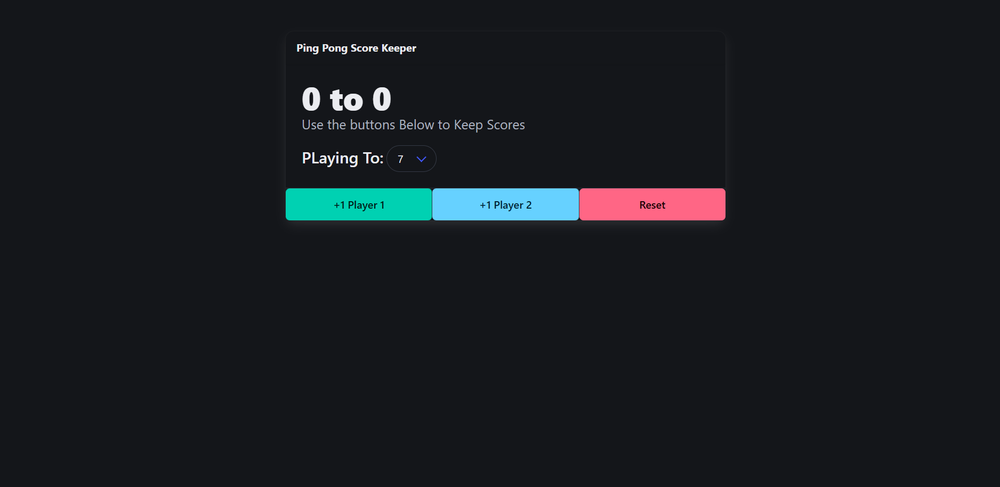

# 🏓 Score Keeper

A simple Ping Pong (or any 2-player game) score keeper built using **HTML**, **CSS (Bulma)**, and **JavaScript**.  
Allows users to set a winning score, track player points, and reset the game with a clean UI.



---

## 🔧 Features

- 🎮 Add points for Player 1 and Player 2
- 🏆 Select a custom winning score from a dropdown
- 🔁 Reset the game at any time
- ✅ Visual indication of winner and loser
- 🧼 Clean and responsive UI using [Bulma CSS Framework](https://bulma.io/)

---

## 🚀 Getting Started

### 📁 Clone the Repository
```bash
git clone https://github.com/anitgt/Score-Keeper.git
cd Score-Keeper
▶️ Open index.html in your browser
No build steps or installation needed. Just open the file to start using the app.

📁 Project Structure
bash
Copy
Edit
Score-Keeper/
├── index.html          # Main HTML page
├── style.css           # Custom CSS (optional)
├── app.js              # JavaScript logic
├── screenshot.png      # Main screenshot
├── screenshot2.png     # Additional screenshot
└── README.md           # Project info

🙌 Contributing
Pull requests are welcome. For major changes, please open an issue first to discuss what you would like to change.

👤 Author
Anit Sarkar
🔗 GitHub Profile

